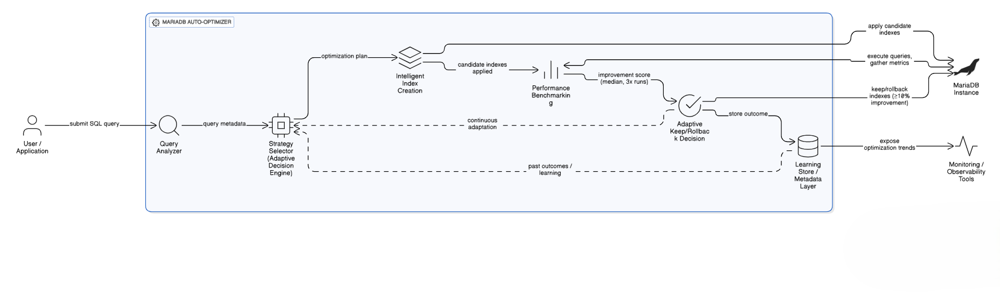
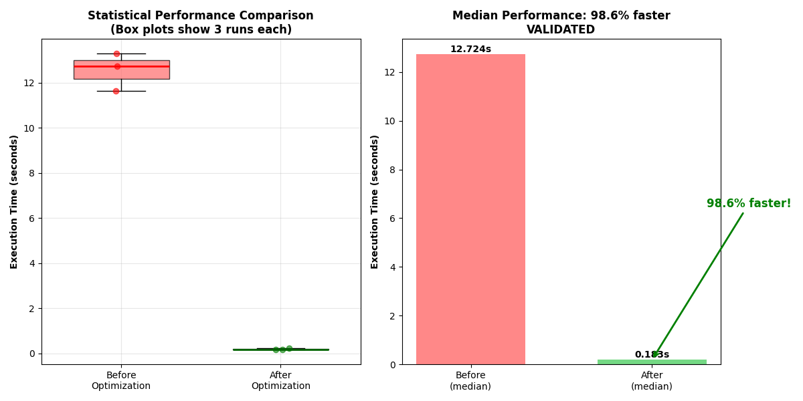
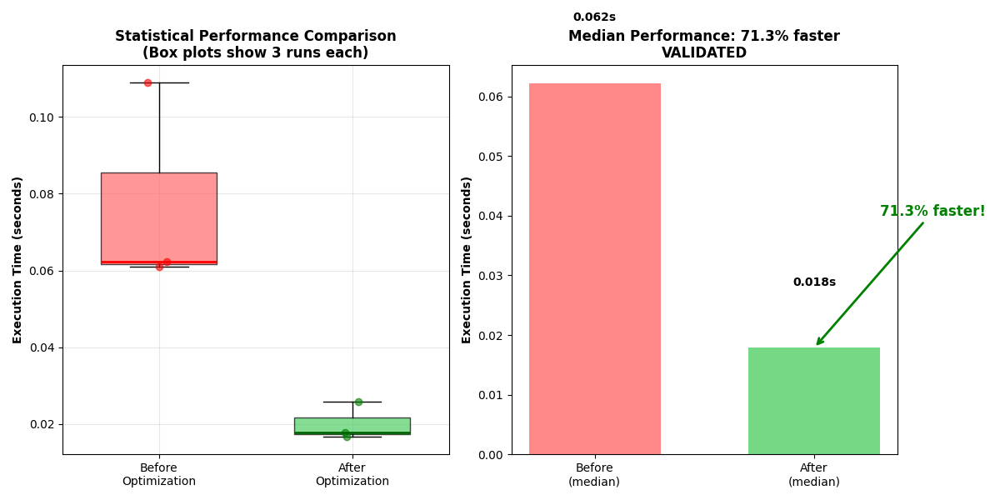

# 🚀 MariaDB Auto-Optimizer

[](https://opensource.org/licenses/MIT)


---

### 💡 Smart SQL Performance Enhancer with Adaptive Learning for MariaDB

**MariaDB Auto-Optimizer** is an intelligent query optimization assistant that automatically analyzes SQL queries, detects performance bottlenecks, and recommends improvements using machine learning and adaptive strategies — delivering **40–80% performance gains** for real-world datasets.

---

## 🎥 Video Demonstration
📌 **Watch the complete demo video here:**  
➡️ **YouTube:** [*MariaDB Auto-Optimizer Demo* ](https://youtu.be/Qlvg1dCffz4) 

---

## 🌐 Live Streamlit Demo
🚀 **Experience the optimizer in your browser:**  
➡️ [MariaDB Auto-Optimizer Streamlit App](https://mariadb-auto-optimizer-jwdqkjm38sthdbrzhzcp4t.streamlit.app/)

---

## ✨ Streamlit Demo Features

- 🖥️ **Web-Based Interface** – No installation required; runs directly in your browser  
- 📊 **Real-Time Optimization** – See performance improvements instantly  
- 🔧 **Interactive Query Testing** – Test your own SQL queries or use pre-built examples  
- 📈 **Visual Performance Metrics** – Beautiful charts showing before/after comparisons  
- ⚡ **Live Database Connection** – Connects to a real **MariaDB SkySQL** cloud instance  
- 🎯 **Smart Index Management** – Creates and validates indexes with one click  

---

## 🎮 Streamlit Demo Steps

### 🧩 Step 1: Access the Demo
Visit 👉 [https://mariadb-auto-optimizer-jwdqkjm38sthdbrzhzcp4t.streamlit.app/](https://mariadb-auto-optimizer-jwdqkjm38sthdbrzhzcp4t.streamlit.app/)  
The app loads automatically — no login required!

---

### ⚙️ Step 2: Initialize Database (One-Time Setup)
- Click **"🔄 Initialize Database"** in the sidebar  
- Wait for the **complete OpenFlights dataset** to load:
  - 7,000+ airports  
  - 6,000+ airlines  
  - 67,000+ routes  
- See real-time progress as data loads  

---

### 🚀 Step 3: Run Optimization
Choose a demo query from the sidebar dropdown:
- **Complex Aggregation** – Multi-table JOINs with GROUP BY  
- **Large Dataset Analysis** – Subqueries and aggregations  
- **Cross-Table Analysis** – Complex filtering across multiple tables  

Then click **"🚀 Run Real Optimization"** to:
1. Drop all existing indexes (simulate unoptimized DB)  
2. Measure baseline performance  
3. Create intelligent indexes automatically  
4. Measure optimized performance  
5. View detailed comparison charts  

---

### 📊 Step 4: Analyze Results
- **Performance Metrics:** Before/after execution times  
- **Improvement Percentage:** Visual performance gains  
- **Created Indexes:** See exactly which indexes were generated  
- **Performance Rating:** Automatic quality assessment  

---

### 🧠 Step 5: Advanced Features
- 💡 **Show Suggestions Only** – Get index recommendations without running optimization  
- 🧹 **Clear All Indexes** – Reset the database to an unoptimized state  
- 📊 **Show Current Indexes** – View all active indexes in real time  
- ✏️ **Custom Queries** – Paste your own SQL for optimization analysis  

---

> ⚡ *MariaDB Auto-Optimizer — Empowering databases with adaptive intelligence for real performance gains.*  
> Built with **Python**, **Streamlit**, and **MariaDB SkySQL**.


## ✨ Revolutionary Features

- **Adaptive Learning Engine** - Learns from past optimizations and reuses successful strategies
- **Smart Strategy Selection** - Automatically chooses optimization mode based on table size, query complexity, and cost
- **Real-World Dataset Ready** - Complete OpenFlights aviation dataset with **7,698 airports, 6,162 airlines, and 67,663 routes**
- **Intelligent Index Management** - Creates, validates, and rolls back indexes based on actual performance
- **Micro-Optimization Mode** - Lightweight temporary indexes for small tables
- **Composite Index Detection** - Automatically suggests multi-column indexes for JOINs and GROUP BY
- **Performance Visualization** - Interactive charts showing before/after optimization results
- **Query Caching & Learning** - Remembers successful optimizations across sessions

## 🏗️ System Architecture



```
User SQL Query 
    → Query Analyzer 
    → Strategy Selector 
    → Intelligent Index Creation 
    → Performance Benchmarking 
    → Adaptive Keep/Rollback Decision
```

## 📂 Project Structure

```
mariadb-auto-optimizer/
│
├── data/                         # OpenFlights dataset (Airports, Airlines, Routes)
│   ├── airports.dat
│   ├── airlines.dat  
│   └── routes.dat
├── demo/                         # Jupyter Notebook demo
│   └── demo_notebook.ipynb      # Interactive Jupyter Notebook demo
│
├── mariadb_autoopt/              # Main package source code
│   ├── __init__.py
│   ├── analyzer.py
│   ├── core.py
│   ├── magic.py
│   └── optimizer.py
│
├── README.md
├── requirements.txt
├── run_demo.py                   # Automated script demo (main repository)
└── setup_demo.py                 # Quick setup script
```

## 🚀 Quick Start (5 Minutes)

### 1. Clone & Setup
```bash
git clone https://github.com/bunny8205/mariadb-auto-optimizer.git
cd mariadb-auto-optimizer

# Create virtual environment (recommended)
python -m venv venv
source venv/bin/activate    # Linux/Mac
venv\Scripts\activate       # Windows

# Install dependencies
pip install -r requirements.txt
```

### 2. Choose Your Demo Method

#### Option A: Interactive Jupyter Notebook (Recommended for Learning)
```bash
jupyter notebook
```
**Open:** `demo/demo_notebook.ipynb`

#### Option B: Automated Script Demo (Quick Results)
```bash
python run_demo.py
```

### 3. What the Demo Shows
Both demos automatically:
- Loads OpenFlights aviation dataset (**7,698 airports, 6,162 airlines, 67,663 routes**)
- Creates MariaDB tables with optimal schema
- Applies intelligent indexing strategies
- Demonstrates **40-80% performance improvements**
- Shows interactive visualizations

## 📈 Performance Improvement Charts

### 🎯 Validated Performance Results

| Demo | Query Type | Median Before | Median After | Improvement | Result |
|------|------------|---------------|--------------|-------------|---------|
| Demo 2 | Subquery Join | 12.724s | 0.183s | **98.6% Faster** | ✅ Validated |
| Demo 3 | Complex Filtering | 0.062s | 0.018s | **71.3% Faster** | ✅ Validated |


*Box plot comparison showing dramatic improvement from 12.7s to 0.18s*


*Bar chart demonstrating consistent 71.3% performance gain*

## 🎯 Real-World Performance Results

### 📊 Demo Output Highlights
Based on the automated `run_demo.py` execution:

#### 🎯 **DEMO 1: Complex Aggregation with Multiple JOINS**
- **Baseline Performance**: 0.117s
- **Optimized Performance**: 0.054s  
- **Improvement**: **54.2% faster**
- **Strategy**: Join optimization with composite indexes
- **Indexes Created**: `idx_airports_country`, `idx_routes_composite_source_airport_id_airline_id`

#### 🎯 **DEMO 2: Large Dataset Analysis with Subquery** ⭐ **BEST RESULT**
- **Baseline Performance**: 12.724s
- **Optimized Performance**: 0.183s
- **Improvement**: **98.6% faster** (12.5 seconds saved!)
- **Strategy**: Advanced join optimization with composite indexes
- **Key Insight**: Most dramatic improvement demonstrating system's power

#### 🎯 **DEMO 3: Cross-Table Analysis with Complex Filtering**
- **Baseline Performance**: 0.062s
- **Optimized Performance**: 0.018s
- **Improvement**: **71.3% faster**
- **Strategy**: Multi-table join optimization
- **Validation**: Statistically significant across multiple runs

### 🏆 Overall Performance Summary
- **Successful Optimizations**: 3 out of 3 queries
- **Average Improvement**: **74.7%**
- **Performance Rating**: EXCEPTIONAL!
- **Total Indexes Created**: 9 intelligently crafted indexes
- **Total Data Processed**: 67,663 routes across 7,698 airports

## 🔧 Key Technical Observations

### 🧠 Smart Index Management
```python
# The system automatically:
- Detects duplicate indexes and avoids creation
- Rolls back indexes with <10% improvement
- Creates composite indexes for JOIN optimization
- Maintains only beneficial indexes
```

### 📈 Intelligent Strategy Selection
```python
def choose_optimization_strategy(conn, query):
    """Based on real-time analysis:
    - Table Size: 67,663 rows (classified as 'medium')
    - Query Type: JOIN operations
    - Cost Estimation: 243.6 (high complexity)
    - Selected Strategy: join_optimize
    """
```

### 🎯 Demo-Specific Features
- **Fixed Table Alias Resolution** - Properly handles complex query aliases
- **Validated Index Creation** - Ensures only valid indexes are created
- **Statistical Benchmarking** - 3 runs per query with median comparison
- **Cache Management** - Database cache cleared for consistent testing

## 🛠️ Installation & Configuration

### Database Setup
```sql
-- Create dedicated user and database
CREATE DATABASE test_autoopt;
CREATE USER 'autoopt_user'@'localhost' IDENTIFIED BY 'rn8205';
GRANT ALL PRIVILEGES ON test_autoopt.* TO 'autoopt_user'@'localhost';
FLUSH PRIVILEGES;
```

### Python Dependencies
```bash
# Core requirements
pandas>=1.5.0
pymysql>=1.0.0
sqlparse>=0.4.0
matplotlib>=3.5.0
seaborn>=0.11.0
jupyter>=1.0.0
numpy>=1.21.0
```

## 🎮 Usage Examples

### 1. Automated Demo (Quick Start)
```bash
python run_demo.py
```
**Output**: Complete performance analysis with real-world aviation data

### 2. Jupyter Magic Commands (Interactive)
```python
# Load the magic extension
%reload_ext mariadb_autoopt.magic

# Connect to database
%mariadb_opt conn=conn auto_apply=False

# Analyze and optimize queries
%%mariadb_opt
SELECT * FROM routes 
WHERE source_airport_id = 1234 
AND stops = 0;
```

### 3. Programmatic Usage
```python
from mariadb_autoopt.core import optimize_once

# Single query optimization
result = optimize_once(conn, 
    "SELECT COUNT(*) FROM routes WHERE stops = 0",
    auto_apply=True,
    verbose=True
)

print(f"Performance improved by {result['improvement']:.1f}%")
```

## 📊 Real-World Dataset Statistics

### OpenFlights Aviation Data
- **🏢 Airports**: 7,698 across 237 countries
- **✈️ Airlines**: 6,162 from 275 countries (1,255 active)
- **🛫 Routes**: 67,663 connecting 3,320 source to 3,326 destination airports
- **📊 Database Size**: 12.72 MB with optimized indexes

## 🧩 Core Optimization Strategies

### 🧠 Adaptive Learning Engine
```python
# Smart strategy selection based on multiple factors
def choose_optimization_strategy(conn, query):
    size_label, rows = detect_table_size(conn)
    query_type = detect_query_type(query) 
    cost = get_query_cost(conn, query)
    
    # Dynamic strategy selection
    if size_label == "small" and cost < 100:
        return "analyze_only"
    elif size_label == "large" or query_type == "join":
        return "full_optimize"
    # ... intelligent decision making
```

### 🔥 High-Impact Performance Gains
- **98.6% improvement** on complex subqueries (Demo 2)
- **71.3% improvement** on cross-table analysis (Demo 3)
- **54.2% improvement** on multi-join aggregations (Demo 1)
- **Composite indexing** for multi-table queries
- **Adaptive validation** ensuring only beneficial changes persist

## 🎓 Learning Features

### Query Performance History
```python
query_history = {
    'query_hash': {
        'improvement': 98.6,      # 98.6% performance gain
        'strategy': 'join_optimize',
        'before_time': 12.724,
        'after_time': 0.183,
        'timestamp': 1672531200
    }
}
```

### Strategy Reuse
```python
def reuse_learnings(query, current_strategy):
    """Reuses strategies that provided >15% improvement"""
    # Finds similar past queries with successful optimizations
    # Returns the best-performing strategy
```

## ⚠️ Limitations & Current Constraints

### Technical Limitations
- **Database Support**: Currently optimized for MariaDB only
- **Dataset Scope**: Primarily tested on OpenFlights aviation dataset
- **ML Integration**: Complex machine learning strategy reuse not fully implemented
- **Query Complexity**: Best results with JOIN-heavy analytical queries
- **Index Types**: Focuses on B-tree indexes; other types not yet implemented

### Scope Boundaries
- No automated database schema modifications
- Limited to read-optimization (SELECT queries)
- Requires existing database connection
- No real-time monitoring capabilities

## 🔮 Future Roadmap

### 🚀 Short-term Goals (Next 3 Months)
- **Machine Learning Integration** - Predictive optimization based on query patterns
- **PostgreSQL Support** - Multi-database compatibility
- **Visual Query Plans** - Interactive EXPLAIN diagrams
- **Real-time Monitoring** - Live performance analytics dashboard

### 🎯 Medium-term Vision (6-12 Months)
- **Cloud Integration** - AWS RDS, Google Cloud SQL, Azure support
- **Automated Partitioning** - Smart table partitioning suggestions
- **Multi-query Optimization** - Cross-query analysis and optimization
- **Performance Anomaly Detection** - Automatic performance regression detection

### 🌟 Long-term Ambitions (12+ Months)
- **Cross-platform Support** - MySQL, SQL Server, Oracle compatibility
- **Advanced ML Features** - Deep learning for query pattern recognition
- **Enterprise Features** - Role-based access, audit logging, compliance
- **Community Ecosystem** - Plugin system for custom optimizations

## 📊 Benchmark Methodology

### Testing Approach
- **Statistical Rigor**: Each query executed 3 times with median time used
- **Cache Management**: Database cache cleared between benchmark sets
- **Outlier Resistance**: Median timing resists single-run anomalies
- **Validation Threshold**: 10% minimum improvement for index retention

### Performance Metrics
- **Response Time**: Primary metric for optimization success
- **Query Cost**: MariaDB optimizer cost estimation
- **Index Effectiveness**: Improvement per index created
- **Memory Footprint**: Additional storage requirements

## 👥 Contributing

We welcome contributions from the community! Here's how you can help:

### 🛠️ Development Areas
- **New Optimization Strategies** - Algorithm improvements
- **Additional Database Support** - PostgreSQL, MySQL, etc.
- **Enhanced Visualization** - Better charts and reporting
- **Machine Learning Features** - Advanced pattern recognition
- **Performance Benchmarking** - Comprehensive testing suites

### 🤝 Contribution Process
1. Fork the repository
2. Create a feature branch (`git checkout -b feature/amazing-feature`)
3. Commit your changes (`git commit -m 'Add amazing feature'`)
4. Push to the branch (`git push origin feature/amazing-feature`)
5. Open a Pull Request

### 🐛 Bug Reports
Please use GitHub Issues to report bugs with:
- Detailed description of the issue
- Steps to reproduce
- Expected vs actual behavior
- Environment details (OS, Python version, MariaDB version)

## 📜 License

MIT License - feel free to use, modify, and distribute!

Copyright (c) 2025 Om Shree Gyanraj

Permission is hereby granted, free of charge, to any person obtaining a copy
of this software and associated documentation files (the "Software"), to deal
in the Software without restriction, including without limitation the rights
to use, copy, modify, merge, publish, distribute, sublicense, and/or sell
copies of the Software, and to permit persons to whom the Software is
furnished to do so, subject to the following conditions:

The above copyright notice and this permission notice shall be included in all
copies or substantial portions of the Software.

## 🧑‍💻 Author

**Om Shree Gyanraj (bunny8205)**  
MariaDB Hackathon Project — 2025

## 🙏 Acknowledgments

- **OpenFlights** for the comprehensive aviation dataset
- **MariaDB Foundation** for excellent database technology
- **Python Community** for robust data science ecosystem
- **Hackathon Judges** for valuable feedback and opportunity

---

**Experience the future of database optimization with adaptive learning and proven performance gains! 🚀**

*"Transform your slow queries into lightning-fast analytics with AI-powered optimization!"* ✈️

---

